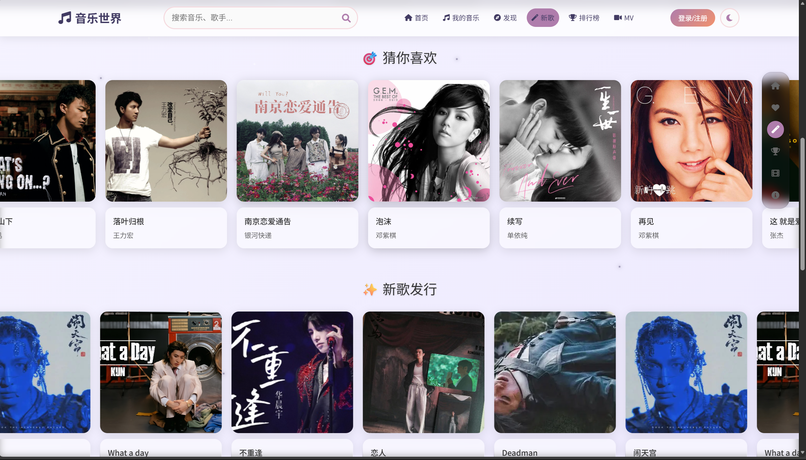

# 🎵 星乐 (Spcae Music) - 沉浸式音乐世界

欢迎来到“星乐”，一个功能丰富、视觉效果惊艳的现代音乐 Web 应用程序。

本项目是一个完整的、从引导到播放的沉浸式音乐体验。它由三个核心部分组成：

1.  **开始界面 (`start.html`)**: 一个采用全屏滚动和丰富动画（流星、蝴蝶、开花）的产品引导页。
2.  **功能主页 (`homepage.html`)**: 一个集成了 WebGL、GSAP 动画和 View Transitions API 的现代化音乐发现主页。
3.  **音乐中心与播放器 (`mymusic.html` & `music-player.html`)**: 一个功能齐全的用户中心和具有音视频(MV)双核同步功能的沉浸式播放器。

---

## 🌟 项目一览 (Project Showcase)

| 引导页 (Start Page) | 引导页 - 功能介绍 |
| :---: | :---: |
|  |  |
|  |  |

| 主页 (Homepage) | 音乐中心 (My Music) |
| :---: | :---: |
|  |  |
|  |  |

| 沉浸式播放器 (Player) | 播放器 - MV 模式 |
| :---: | :---: |
|  |  |

---

## ✨ 核心功能与特点

本项目的开发重点在于将高级视觉特效与健壮的播放器功能相结合，创造出色的用户体验。

### 1. 视觉与沉浸感 (Visuals & Immersion)

* **多层动态背景**:
    * **WebGL 动态海浪**: 主页背景采用 **Vanta.js (Three.js)** 驱动的 WebGL 海浪，实现了 GPU 加速的 3D 动态效果。
    * **CSS 动画特效**: 全站（包括引导页）大量使用纯 CSS 实现了流星雨、飘落星星、蝴蝶飞舞、花朵绽放等动画。
    * **JS 交互式粒子**: 主页和音乐中心实现了跟随鼠标飘落的雪花粒子特效，提供即时趣味性交互。
* **现代毛玻璃质感 (Glassmorphism)**:
    * 整个 UI（导航栏、侧边栏、主内容区、登录弹窗）均采用现代的 `backdrop-filter: blur()` 毛玻璃模糊特效，质感通透。
* **双重主题系统**:
    * **明暗双模 (Homepage / MyMusic)**: 主页和音乐中心支持一键切换明亮/暗黑两种模式，主题设置会保存在 `localStorage` 中。
    * **动态氛围 (Player)**: 沉浸式播放器会使用 **ColorThief.js** 自动分析当前歌曲封面，提取主题色，并将其动态应用到背景氛围光和黑胶光晕上。

### 2. 交互体验 (UX & Animations)

* **原生级页面过渡**:
    * 采用实验性的 **View Transition API** (`document.startViewTransition`)。 当在主页点击卡片时，封面和标题会实现丝滑的“共享元素”过渡动画，提供媲美原生 App 的无缝跳转体验。
* **专业动画库应用**:
    * **GSAP 无限滚动**: 主页的“猜你喜欢”模块采用 **GSAP** 动画库来实现无限循环的 Marquee (跑马灯) 效果，并实现了“鼠标悬停时减速”的细节。
    * **Swiper 3D 封面流**: 主页的“推荐 MV”模块使用了 **Swiper.js** 库，实现了经典的 3D Coverflow (封面流) 效果，支持触摸滑动。
* **丰富的微交互**:
    * **3D 倾斜卡片**: 主页卡片会根据鼠标位置产生 3D 倾斜效果。
    * **导航栏“药丸”滑动**: 顶部导航栏的激活项会有一个“药丸”背景（Nav Pill）平滑移动过去，提供了清晰的视觉焦点。
    * **可拖动侧边栏**: 主页的锚点导航栏支持用户自由拖拽。
    * **按钮波纹**: 播放器中的所有按钮（包括播放列表）在点击时均有 Material Design 风格的波纹反馈。
    * **引导页全屏滚动**: `start.html` 支持鼠标滚轮和点击导航点进行全屏平滑滚动。

### 3. 播放器核心 (Player Core)

* **🎬 音视频(MV)双核播放系统 (重点功能)**:
    * **音频模式**: 默认播放高解析度音频，并展示动态旋转的黑胶唱片。
    * **MV 模式**: 一键切换。播放器会自动暂停音频，转而播放高清 MV 并使用其音轨。 所有控件（进度条、音量、时长）都会自动与视频同步。
* **🎤 3D 齿轮歌词滚动**:
    * 自动解析 `.lrc` 歌词文件，以 3D 齿轮状滚动，当前行高亮。
    * 支持点击任意一行歌词跳转到歌曲对应进度。
* **🎧 实时音频可视化**:
    * （在音频模式下）播放器控制栏的频谱条会通过 **Web Audio API** 实时分析音乐节拍并跳动。
* **▶️ 播放列表“活力”图标**:
    * 在播放列表弹窗中，正在播放的歌曲会显示一个动态的声波动画图标，取代了静态高亮。

### 4. 用户中心与管理 (User & Management)

* **👤 “我的音乐”中心**:
    * 一个功能完整的用户中心页面 (`mymusic.html`)，包含可自定义的个人资料侧边栏。
    * 使用 JavaScript 驱动的标签页，用于切换**“我的收藏”、“最近播放”、“本地音乐”** 和 “编辑资料”。
* **💾 持久化体验 (localStorage)**:
    * **记住音量**: 用户调节的音量大小会被自动保存。
    * **记住收藏**: 用户的“喜欢”列表会保存在本地。
    * **记住播放列表顺序**: 下文提到的拖拽排序结果也会被保存。
* **🖐️ 播放列表拖拽排序**:
    * 用户可以在播放列表弹窗中通过 **Drag and Drop API** 随意拖拽歌曲，以调整播放顺序。 `上一首/下一首` 按钮会严格遵循用户自定义的新顺序。

---

## 🛠️ 技术栈 (Technology Stack)

* **前端**: HTML5, CSS3 (Flexbox, Grid, Animations, CSS 变量)
* **JavaScript (ES6+)**:
    * **原生 JS (Vanilla JS)**: 项目主体逻辑均由原生 JS 编写，无框架依赖。
    * **核心 API**:
        * Web Audio API (用于频谱)
        * Drag and Drop API (用于拖拽排序)
        * localStorage (用于持久化)
        * View Transition API (用于页面过渡)
        * IntersectionObserver (用于滚动监听)
    * **动画库**:
        * **GSAP (GreenSock)**: 用于高性能的无限滚动动画。
        * **Three.js (Vanta.js)**: 用于主页的 WebGL 3D 海浪背景。
        * **Swiper.js**: 用于 3D 封面流轮播。
    * **工具库**:
        * **ColorThief.js**: 用于从歌曲封面提取主题色。
* **构建脚本 (Build Script)**:
    * **Node.js**: 使用 `fs` 和 `path` 模块扫描文件系统，自动生成歌曲列表。
* **字体与图标**:
    * Font Awesome
    * Google Fonts

---

## 🚀 如何运行

### 依赖
您必须在您的电脑上安装 **Node.js** (安装 LTS 版本即可)。

### 1. 添加歌曲（关键步骤）

本项目通过 Node.js 脚本动态管理歌曲列表，您**无需**手动编辑任何 JSON 或 HTML 列表。

**第一步：准备歌曲文件夹**

在项目根目录中找到 `songs/` 文件夹。您需要为您想添加的**每一首**歌曲创建一个单独的文件夹。

例如，要添加“泡沫”这首歌，您应该创建 `songs/paomo/` 文件夹。

**第二步：在文件夹中添加资源**

将所有相关资源放入您刚创建的文件夹 (`songs/paomo/`) 中：

1.  **`info.json` (必需)**: 包含歌曲信息的 JSON 文件。
2.  **音频文件 (必需)**: 例如 `G.E.M.邓紫棋-泡沫.flac` 或 `audio.mp3`。
3.  **`cover.jpg` (必需)**: 歌曲封面图。
4.  **`lyrics.lrc` (可选)**: 歌词文件。
5.  **`video.mp4` (可选)**: MV 视频文件。

**第三步：配置 `info.json` 文件**

这是最关键的一步。`info.json` 文件必须严格遵循以下格式，**文件名必须与您放入文件夹中的文件名完全一致**：

```json
{
  "title": "泡沫",
  "artist": "G.E.M.邓紫棋",
  "album": "Xposed",
  "audio": "G.E.M.邓紫棋-泡沫.flac",
  "mv": "video.mp4"
}
```
"audio": 必须匹配您的音频文件名 (如 .flac, .mp3)。

"mv": 必须匹配您的视频文件名 (如 .mp4)。如果这首歌没有 MV，请将值设为 null 或者 ""。


**第四步：运行脚本**


在项目根目录打开终端，运行：

```Bash

node build-playlist.js
```

**第五步：检查结果**


脚本会自动扫描 songs/ 目录下的所有子文件夹，读取它们的 info.json，然后生成（或更新）一个 playlist.json 文件。

您每次添加或删除歌曲文件夹时，都需要重复第四步来刷新列表。


**启动项目**


由于本项目使用 fetch API 异步加载 playlist.json 和 .lrc 文件，您不能直接通过双击 start.html (即 file:/// 协议) 运行。

您必须使用一个本地服务器。

推荐方式 (VS Code):

在 VS Code 中打开项目文件夹。

安装 Live Server 插件。

在 start.html (引导页) 或 homepage.html (主页) 文件上右键，选择 Open with Live Server。

浏览器将自动打开并运行项目。
```
📁 文件结构 (简)
.
├── 📄 start.html             # 引导页 (项目入口之一)
├── 📄 homepage.html           # 音乐主页 (项目入口之一)
├── 📄 mymusic.html            # 我的音乐 (用户中心)
├── 📄 music-player.html       # 沉浸式播放器 (由 mymusic.html 嵌入)
│
├── 🎨 start.css              # 引导页样式
├── 🎨 homepage.css            # 主页样式
├── 🎨 mymusic.css             # 音乐中心样式
├── 🎨 music-player.css        # 播放器样式
│
├── ⚙️ function.js             # 引导页逻辑
├── ⚙️ homepage.js             # 主页逻辑
├── ⚙️ mymusic.js              # 音乐中心逻辑 (充当播放器遥控器)
├── ⚙️ music-player.js         # 播放器核心逻辑
├── ⚙️ mouse-trail.js          # (start.html) 鼠标拖尾特效
│
├── 🔧 build-playlist.js       # (Node.js) 歌曲列表生成脚本
├── 📄 playlist.json           # (自动生成) 歌曲配置文件
│
├── 📁 img/                     # (新增) README 使用的截图
│   ├── 屏幕截图 ... .png
│   └── ...
│
├── 📁 songs/                  # 歌曲资源目录
│   └── 📁 paomo/ (示例)
│       ├── 📄 info.json
│       ├── 🎵 G.E.M.邓紫棋-泡沫.flac
│       ├── 🖼️ cover.jpg
│       ├── 💬 lyrics.lrc
│       └── 🎬 video.mp4
│
└── 📁 graphics/               # 引导页的图片资源
```
